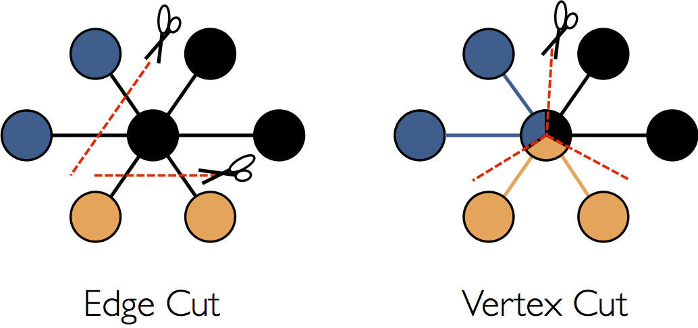

Pregel原理分析与Bagel实现
==============

[pregel 2010年](http://people.apache.org/~edwardyoon/documents/pregel.pdf)就已经出来了, [bagel](https://spark.apache.org/docs/latest/bagel-programming-guide.html)也2011年
就已经在spark项目中开源, 并且在最近的graphX项目中声明不再对bagel进行支持, 使用graphX的"高级API"进行取代, 种种迹象好像说明pregel这门技术已经走向"末端", 其实个人的观点倒不是这样的; 
最近因为项目的需要去调研了一下图计算框架,当看到pregel的时候就有一种感叹原来"密密麻麻"的图计算可以被简化到这样. 虽然后面项目应该是用graphx来做,但是还是想对pregel做一个总结.

###Pregel的原理分析
说到MapReduce,我们想到的是Hadoop这种类型的计算平台, 可是我更加愿意把它理解为一个编程思想或一种算法. 虽然现在Spark中采用"高级API"来提供一种数据处理的接口,但是它的核心还是map, 还是
reduce,以及shuffle. Pregel所处的位置和MapReduce也一样.

Pregel来自google, 最初是为了解决PageRank计算问题，由于MapReduce并不适于这种场景，所以需要发展新的计算模型, 从而产生了Pregel. Pregel和MapReduce一样, 模型很简单,
Spark中基于Pregel的开源实现Bagel也不过300行代码, 但是很强大. 

Pregel解决的是图计算问题, 随着数据量的增长, 不管单机算法多么牛逼, 都无法解决现实中的问题.因此需要使用分布式的算法和平台来解决. Pregel就是一个分布式图计算框架. 分析pregel之前,我们
首先来思考两个问题:

+   整个图的数据是分布多个机器上, 首先需要解决的问题就是图的划分, 按照边进行划分?还是按照顶点进行划分?划分以后怎么表示整个分布式图和每个子图?
+   图是分布式的存储, 那么图上算法怎么进行计算? 不同机器上的顶点之间进行进行交互?

下面我们就来看Pregel是怎么解决这两个问题的. 

####图的切割方式
虽然我们这里讨论是图计算,其实图的分布式表示也是图数据库中核心问题.因为只有切割了以后,一个大图才可以被分布式图数据库进行存储. 图数据因为顶点/边之间的强耦合性, 
切割的方式方法比行列式数据要复杂很多, 切割的不合理会导致机器之间存储不均衡, 计算过程中也会因此带来大量的网络通信. 这两点也是衡量一个图切割的方法好坏的标准.

图的分布式表示有两种切割方式: 点切法和边切法,下图来自Spark GraphX, 为图的两种切法的可视化表示

按照边切法的结果是原始图中每个顶点所有边都存储在一台机器上, 换句话说, 不管按照哪条边进切割, 任何一个顶点的关联边都在一台机器上,但是边的另外一个顶点, 有可能分布
在另外一个机器上, 即在边上只存储了目标顶点的索引数据. 
边切法好处是对于读取某个顶点的数据时, 只要到一台机器上就可以了, 缺点是如果读取边的数据和目标顶点有关系, 那么就会引起跨机器的通信开销.

按照点切发的结果是原始图中每条边的数据(属性数据, 原始顶点, 目标顶点)都存储在一台机器上, 但是一个顶点的所有关联边数据可能分布在所有的机器上.
点切法好处是处理一条边时, (原始顶点, 边数据, 目标顶点)的三份数据都在一台机器上, 对应每个顶点的所有边,也可以并行在多台机器上进行计算, 因此减少了处理过程中的网络的开销.
但是缺点如果对一个顶点进行进行修改, 需要将它同步到多个子图中. 即图节点值数据的一致性问题。

现在问题来了, Pregel是点切法还是边切法呢?答案是边切法. 在Pregel中, 将图虚化为无数的顶点,每个顶点分配一个标示符ID,并保存了该顶点所关联的所有下游节点(即边)
每一次迭代过程中, 分别对每个顶点进行出来, 并将每个顶点的处理结果通过消息发送给它的关联节点. 上面我们谈到, 边切法的缺陷是引起跨机器开销, 但是Pregel有combine等机制,对消息进行
合并,从而优化了跨机器的开销, 关于combine后面会详细描述.

注意: 我们这里谈到Pregel是边切法, Bagel的实现也是边切法, 但是spark graphX的实现是点切法; 关于graphX后面再开文具体进行描述. 这里不要因为这里解释而误导对graphX的理解

####Pregel运行模式:BSP计算模型
Pregel是遵循BSP计算模型, BSP即整体同步并行计算模型(Bulk Synchronous Parallel Computing Model), 基于该模型的分布式计算项目也很多,其中包括Apache的顶级项目[Hama](https://hama.apache.org/),

>   Many data analysis techniques such as machine learning and graph algorithms require iterative computations,
>   this is where Bulk Synchronous Parallel model can be more effective than "plain" MapReduce. Therefore To run such iterative data analysis applications more efficiently, 
>   Hama offers pure Bulk Synchronous Parallel computing engine. 

从Hama的描述来看,BSP计算模型在处理迭代计算(iterative computations)有着很大的性能优势;那么BSP具体是什么呢?

BSP计算模型由Master和Worker组成, 其中Master负责Worker之间的协调工作,而所有的Worker之间同步执行, Worker之间通过消息的方式进行同步; 其中Master协调工作的核心概念为超级步(superstep),
和计算机的时钟概念类似, 每一个超级步为一次迭代, 所以站在BSP 整体角度来看, BSP程序从开始到结束,由一组超级步组成.

每一个超级步的从开始必须是在上一个超级步运行完成, 那么每个超级步做了什么工作呢?

+   worker并行计算:BSP模型针对每个worker有一个消息队列, 在每个superstep开始时候,会从消息队列中读取属于该worker的消息; 并完成worker的特定业务的计算
+   每个superstep间迭代的核心是消息, worker在每次迭代开始会读取上一次迭代中其他worker发送给该worker的数据,并在本次迭代完成以后,根据业务需求,将消息发送给特定worker
+   master负责superstep的同步,在superstep开始时,将消息进行合并并分发给相应的worker, 并监控所有worker运行结果, 汇总所有的worker运行结束时候发送的消息. 如果Master监听到
在某次superstep以后,所有worker都标记为结束,那么就结束整个BSP程序的运行.

从上面我们可以看到, 站在BSP程序角度来看, 多个superstep间同步执行, 而superstep内部,每个worker并行运行,并基于消息来进行worker之间的数据交互.
 
 整体来看,BSP模型由模块(每个worker理解为一个模块), 消息(消息的传递, 合并以及分发, Matser的核心功能之一), 同步时钟(superstep间的同步)组成. 
 
 下面我们就来分析一下Pregel中的BSP计算模型的应用.
 
编写Pregel程序的思想是"像顶点一样思考(Think Like A Vertex)", 怎么理解呢? Pregel应用BSP模型的核心是将图中的每个顶点理解为一个模块(worker),整个BSP程序的计算都是维护和更新每个顶点值,
比如PageRank, 维护每个页面顶点的rank值, 单源最短距离就是维护每个顶点到源点的距离.上面我们讨论到Pregel是按照边切法进行切割, 即每个顶点的所有边数据都在同一个机器上, 
此时如果每个顶点为一个worker, 那么在每次superstep中,顶点之间可以并行计算, 并在计算结束以后, 通过消息的方式来与其他顶点之间通信.这里的消息发送源和发送目标很容易理解, 
发送时, 每个顶点将相应的消息发送到该顶点对应的出边顶点, 接受时, 消息经过master合并, 每个顶点接受它入边所对应的消息. 而消息的合并,分发,superstep的同步则由Master进行同步.

从上面一段我们可以总结以下的计算模式:

+   像顶点一样思考, 即每个顶点对应一个处理函数Compute
+   Compute函数应该包含一个消息容器, 在每次superstep时, 由Master传递给每个顶点
+   Compute的核心逻辑是消息处理, 并在完成消息处理以后更新当前顶点的值, 同时根据新的顶点值,将相应的消息分发给自己出边顶点
+   Compute函数内部可以修改一个状态值, Master根据该状态值来确认该迭代是否还需要继续进行迭代

下面我们给出compute函数的原型, 

    void computer(messageIterators msgs){
        for(; !msgs.done; msgs,next()){
            doSomeThing();
        }
        //更新当前顶点值和状态
        update(value, status)
        //给每个出边顶点分发消息
        sendMsgsToNeighborhood()
    }

上面我们基本分析了Pregel的计算模型, 不过我也看到它的缺点: 消息传递的代价. 每一次消息传播其实就传统的shuffle过程, 在消息不是特别大, 可以做内存shuffle, 可以理解.但是消息特别大时候,
可能需要上文件shuffle, 这个代码做过mapreduce/spark都清楚, 每次迭代都是shuffle,性能和带宽肯定是瓶颈.

####Combiners
上面我们谈到,BSP模型每次superstep会因为消息的传递,带来很大的网络开销, 但是其实大部分情况下, 和mapreduce中shuffle一致, 可以优先进行一下map端的combiner操作,来减少网络
传输. 上面我们谈到Pregel是基于边切分, 每个节点一个worker,但是在物理层面, 一组worker可能会调度到一台物理机器上, 因为在将一个消息从这组worker传递到Master上进行聚合之前,可以
在每个物理机器上做combiner操作, 从而减少大量的网络传输. 

比方说, 假如Compute() 收到许多的int 值消息, 而它仅仅关心的是这些值的和, 而不是每一个int的值, 这种情况下,系统可以将发往同一个顶点的多个消息合并成一个消息, 该消息中仅包含它们
的和值，这样就可以减少传输和缓存的开销。

关于combiner注意点: combiners的合并的对象是消息, 而不是每个顶点的数据, 下面我们会介绍pregel中另外一个概念:Aggregators.

####Aggregators
pregel是站在顶点的角度来思考问题, 每次迭代计算都是顶点与相邻顶点之间的消息传递, 但是在某些应用中, 可能需要站在全局图的角度思考问题. 

打一个简单的比如: 每次迭代之前需要计算所有节点的一个度量值的均值, 如果超过一定值, 所有顶点就结束迭代.这个时候,仅仅通过消息是不能进行判断,
需要对全局图顶点做一次aggregator.然后把aggregator的值传递给每个顶点的computer函数, 在computer内部根据aggregator的值来更新顶点的状态.
那么上面的computer函数就需要针对一个参数Aggregator:

    void computer(messageIterators msgs, Aggregator agg){
        for(; !msgs.done; msgs,next()){
            doSomeThing();
        }
        //更新当前顶点值和状态
        update(value, status)
        //给每个出边顶点分发消息
        sendMsgsToNeighborhood()
    }

站在spark角度, pregel的核心对象是存储所有顶点的RDD, 那么aggregator操作,其实就对顶点的RDD做一次reduce操作. 后面我们看到Bagel的实现的时候,就很清晰看到它的功能.

另外需要强调一下,aggregator操作是和每次superstep相关联的, 即每个superstep就会做一次aggregator操作, 并且在这次computer执行之前, 换句话说, aggregator操作是对上一次
superstep的顶点数据做聚合操作.

####图的修改
我们上面谈到, pregel是站在顶点的角度来计算和更新顶点的值,但是在实际的应用中,有一类算法,可能在运行过程中对图的结构进行修改,比如新增节点/边,删除节点/边.
在实现的角度上来, 这个逻辑需要"pregel内核"的执行,computer接口中只能将需求以特定的方式传递给master, 由master进行处理. 目前Bagel是没有实现这种部分逻辑,毕竟大部分应用
是不会在计算过程中做图的修改操作.

但是在原理上看, 图的修改存在一致性的问题, 即多个worker对图并行的对图进行修改,那么怎么保证图修改的一致性呢? Pregel中用两种机制来决定如何调用：局部有序和handlers

在每次个superstep中, 删除会首先被执行, 先删除边后删除顶点,因为顶点的删除通常也意味着删除其所有的出边. 然后执行添加操作, 先增加顶点后增加边, 并且都会在Compute()函数调用前完成.
至于是否是在Aggregator执行之前执行就不太确定了,没有查询到相应的信息, 原则上来说应用是先执行图修改,再执行aggregator. 这种局部有序的操作保证了大多数冲突的结果是确定的。

剩余的冲突就需要通过用户自定义的handlers来解决. 如果在一个superstep中有多个请求需要创建一个相同的顶点,在默认情况下系统会随便挑选一个请求,但有特殊需求的用户可以
定义一个更好的冲突解决策略,用户可以在Vertex类中通过定义一个适当的handler函数来解决冲突. 同一种handler机制将被用于解决由于多个顶点删除请求或多个边增加请求或删除
请求而造成的冲突. 我们委托handler来解决这种类型的冲突,从而使得Compute()函数变得简单,而这样同时也会限制handler和Compute()的交互.

另外有一个图的修改很容易实现, 即纯local的图改变, 例如一个顶点添加或删除其自身的出边或删除其自己. Local的图修改不会引发冲突，并且顶点或边的本地增减能够立即生效,
很大程度上简化了分布式的编程. 这个在Bagel中也比较实现, 毕竟出边是和顶点一起存储在同一个机器上.

----------------------
OK!上面基本上解析了Pregel的原理, 还有一些概念没有谈到, 比如错误容忍, 每次顶点在superstep之前 先做本地的checkout, 在失败的时候可以恢复过来. 这里就不做详细的解析.
下面我们来看具体的Bagel的实现.

###Bagel的实现

